# Student Performance Analysis

## 1. Objective

1. To analyze the academic performance of students.
2. To compare students' performance in Math, Reading and Writing.
3. To study the realtionship between test preparation and student scores.
4. To analyze performance based on gender, lunch type, parental education and race/ethnicity.
5. To find the relationship between different subject scores.
6. To identify the major factors associated with student performance.

## 2. Dataset Description

The dataset contains the performance information of 1000 students.

It includes the following columns:

- Gender
- Race/Ethnicity
- Parental Level of Education
- Lunch
- Test Preparation Course
- Math Score
- Reading Score
- Writing Score

The dataset is used to study how different factors are associated with student academic performance.


## 3. Tools & Technologies

The following tools and technologies were used in this project:

- Python
- Pandas
- Matplotlib
- Seaborn
- VS Code

### Purpose of Tools

- **Python:** Used for programming and data analysis.
- **Pandas:** Used for loading, cleaning and analyzing the dataset.
- **Matplotlib:** Used for creating graphs and charts.
- **Seaborn:** Used for creating data visualizations.
- **VS Code:** Used for writing and running the Python code.


## 4. Data Cleaning and Preprocessing

The dataset was checked before performing the analysis.

The following steps were performed:

- Checked the shape of the dataset.
- Checked the column names and data types.
- Checked for missing values.
- Verified the numerical score columns.
- Calculated the average score of each student.
- Created performance categories based on average scores.
- Created a Pass/Fail result for students.


## 5. Feature Engineering

Feature engineering means creating new useful columns from the existing data.

In this project, three new features were created:

### 5.1 Average Score

The average of Math, Reading and Writing scores was calculated for each student.

Formula:

Average Score = (Math + Reading + Writing) / 3

This gives a single value to represent the overall academic performance of a student.

### 5.2 Result

A Pass/Fail result was created using the average score.

- Average Score >= 40 → Pass
- Average Score < 40 → Fail

### 5.3 Performance Category

Students were also divided into different performance categories based on their average score:

- Poor
- Average
- Good
- Excellent

These features make it easier to analyze and compare student performance.


## 6. OOP Implementation

Object-Oriented Programming (OOP) was used to represent an individual student.

A Student class was created with the following attributes:

- Math score
- Reading score
- Writing score

The class contains two methods:

- average_score() — Calculates the average of Math, Reading and Writing scores.
- pass_or_fail() — Returns Pass if the average score is 40 or above, otherwise Fail.

This demonstrates how individual student data can be represented and processed using a Python class.


## 7. Exploratory Data Analysis

Exploratory Data Analysis (EDA) was performed to understand the patterns and relationships present in the dataset.

The following analyses were performed:

### 7.1 Overall Subject Performance

The average scores of Math, Reading and Writing were calculated to compare performance across subjects.

### 7.2 Gender-wise Analysis

Student performance was compared between male and female students using the average scores of Math, Reading and Writing.

### 7.3 Test Preparation Analysis

Students who completed the test preparation course were compared with students who did not complete it.

The comparison was based on the average scores of the three subjects.

### 7.4 Lunch-wise Analysis

Student performance was compared based on lunch type.

### 7.5 Parental Education Analysis

Average student scores were analyzed for different levels of parental education.

### 7.6 Race/Ethnicity Analysis

The average scores were compared across different race/ethnicity groups.

These analyses were used to identify patterns and associations in student performance.


## 8. Data Visualization

Data visualization was used to understand the results more clearly through graphs and charts.

The following visualizations were created:

### 8.1 Subject-wise Average Score

A bar chart was created to compare the average scores of Math, Reading and Writing.

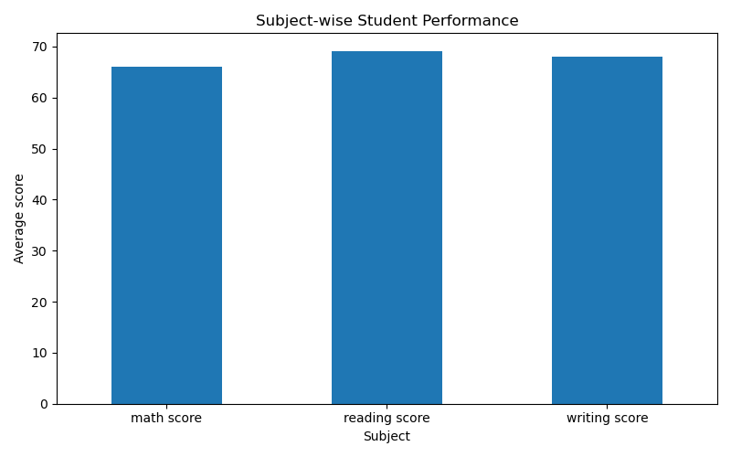

### 8.2 Test Preparation Analysis

A bar chart was used to compare the average performance of students who completed the test preparation course with those who did not.

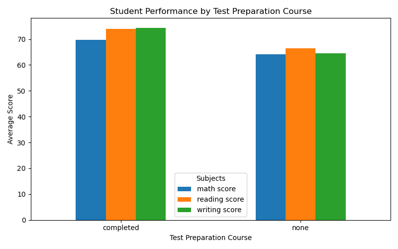

### 8.3 Gender-wise Performance

A bar chart was created to compare the average scores of male and female students.
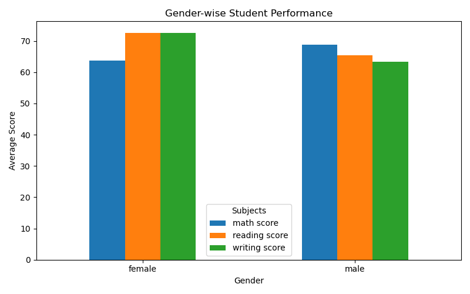

### 8.4 Lunch-wise Performance

A bar chart was used to compare student performance based on lunch type.

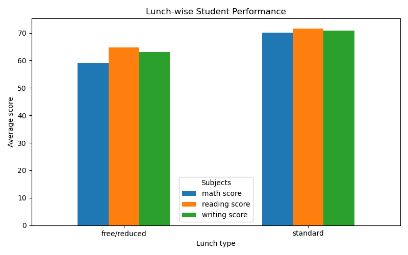

### 8.5 Parental Education Analysis

A bar chart was created to compare average scores across different parental education levels.

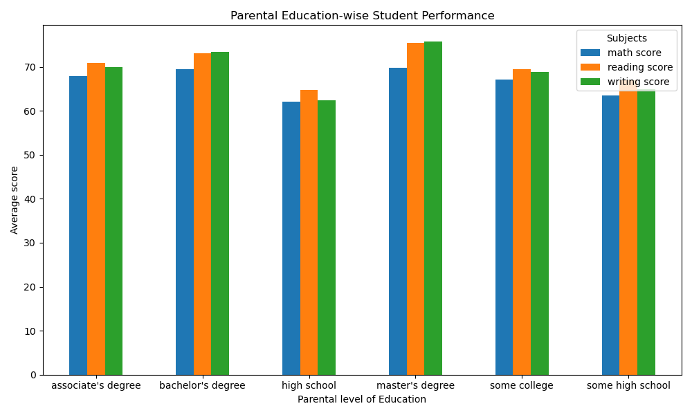

### 8.6 Race/Ethnicity Analysis

A bar chart was used to compare the average scores across different race/ethnicity groups.

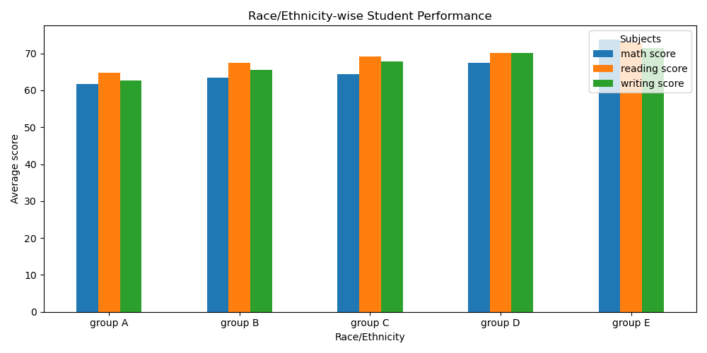

### 8.7 Correlation Heatmap

A correlation heatmap was created to understand the relationship between Math, Reading and Writing scores.

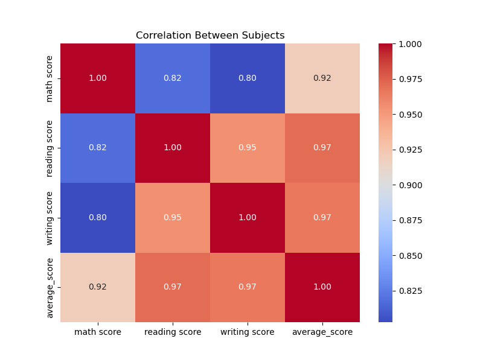
### 8.8 Performance Category Distribution

A bar chart was created to show the number of students in each performance category.

Visualization makes it easier to identify patterns and relationships that may not be obvious from numerical values alone.

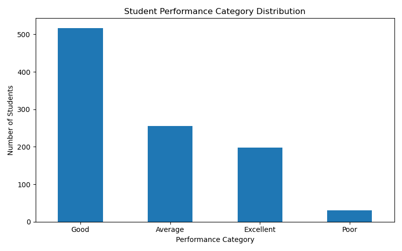

### 8.9 Race/Ethnicity Boxplot

A boxplot was created to compare the distribution of average scores across different race/ethnicity groups.

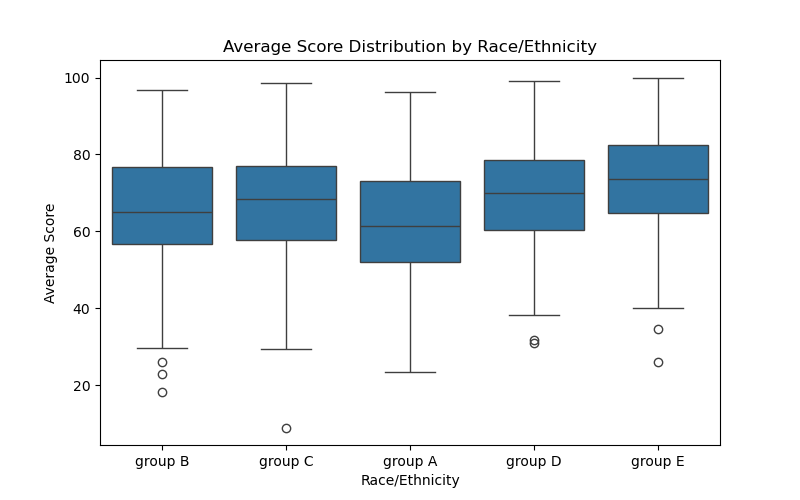

### 8.10 Math vs Reading Scatter Plot

A scatter plot was created to visualize the relationship between Math and Reading scores.

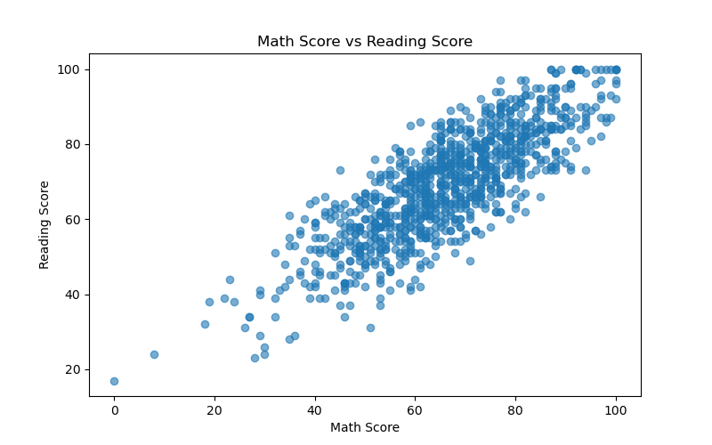

### 8.11 Math Score Histogram

A histogram was created to understand the distribution of Math scores among the students.

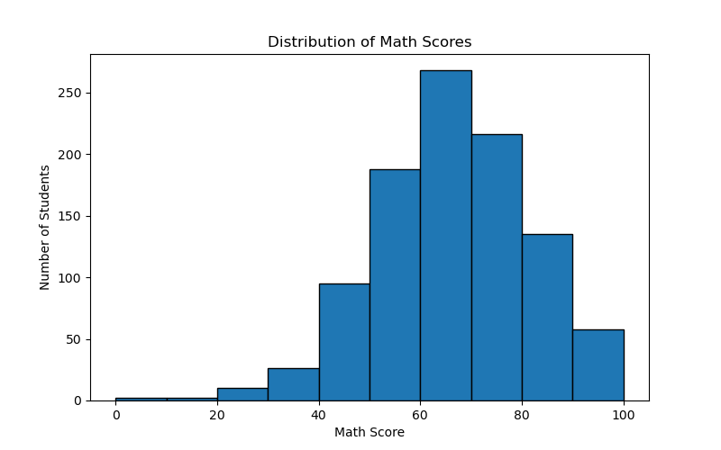

## 9. Key Findings

The analysis of the dataset produced the following findings:

1. The overall average score of the students was approximately 67.77.

2. Reading had the highest average score among the three subjects, followed by Writing and Math.

3. Students who completed the test preparation course had a higher average score than students who did not complete the course.

4. Female students had a higher overall average score than male students, while male students had a higher average Math score.

5. Students with standard lunch had a higher average score compared to students with free/reduced lunch.

6. Students whose parents had a master's degree had the highest average performance among the different parental education groups.

7. Group E had the highest average score among the race/ethnicity groups, while Group A had the lowest average score.

8. Math and Reading scores showed a strong positive relationship, with a correlation of approximately 0.82.

9. Reading and Writing scores showed a very strong positive relationship, with a correlation of approximately 0.95.

10. Most students were classified in the Good performance category based on their average score.

These findings show associations and patterns in the dataset and should not be interpreted as proof of direct causal relationships.


## 10. Recommendations

Based on the analysis, the following recommendations can be made:

1. Encourage students to complete test preparation courses.
2. Provide additional academic support for students who need improvement in Mathematics.
3. Give extra support to students with lower overall scores.
4. Encourage regular study and practice.
5. Use student performance data to identify areas that need improvement.

These recommendations are based on the patterns observed in the dataset.


## 11. Conclusion

This project analyzed the academic performance of 1000 students using Python and different data analysis techniques.

The project covered data loading, data cleaning, feature engineering, exploratory data analysis, statistical relationships, object-oriented programming and data visualization.

The analysis helped identify patterns in student performance based on different factors such as gender, test preparation, lunch type, parental education and race/ethnicity.

Overall, the project provided practical experience in using Python, Pandas, Matplotlib and Seaborn for a real-world data analysis problem.


## 12. Project Structure

The project contains the following files:

```text
capstone_project/
│
├── .jetro/
│   ├── students_performance.py
│   └── StudentsPerformance.csv
│.  |---all PNG files 
└── README.md


